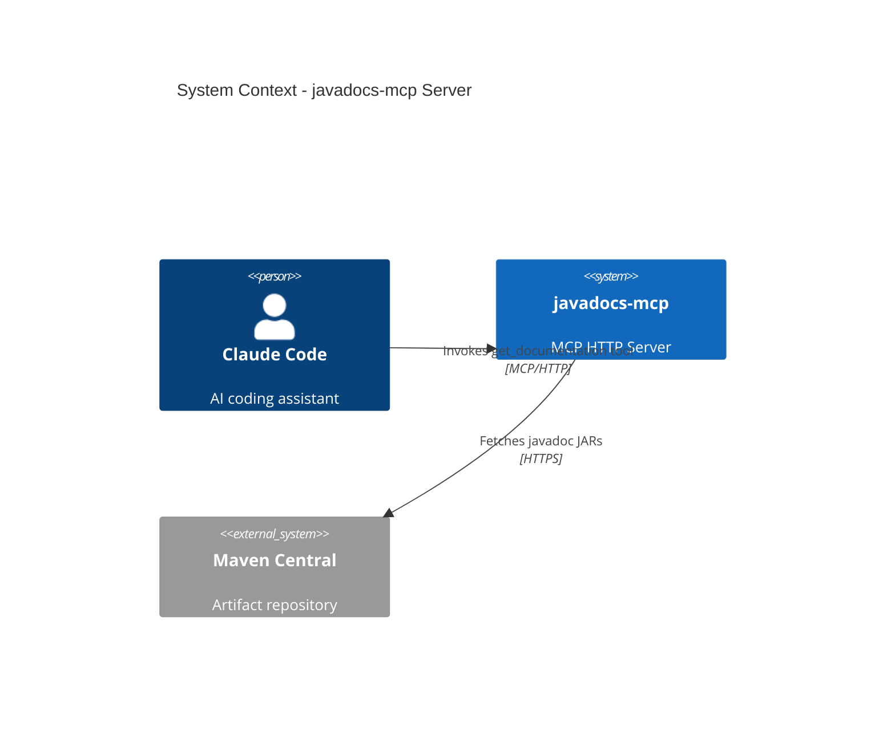
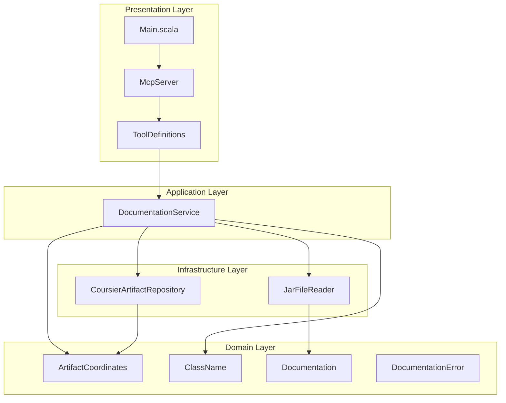
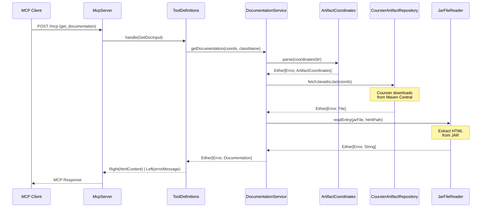
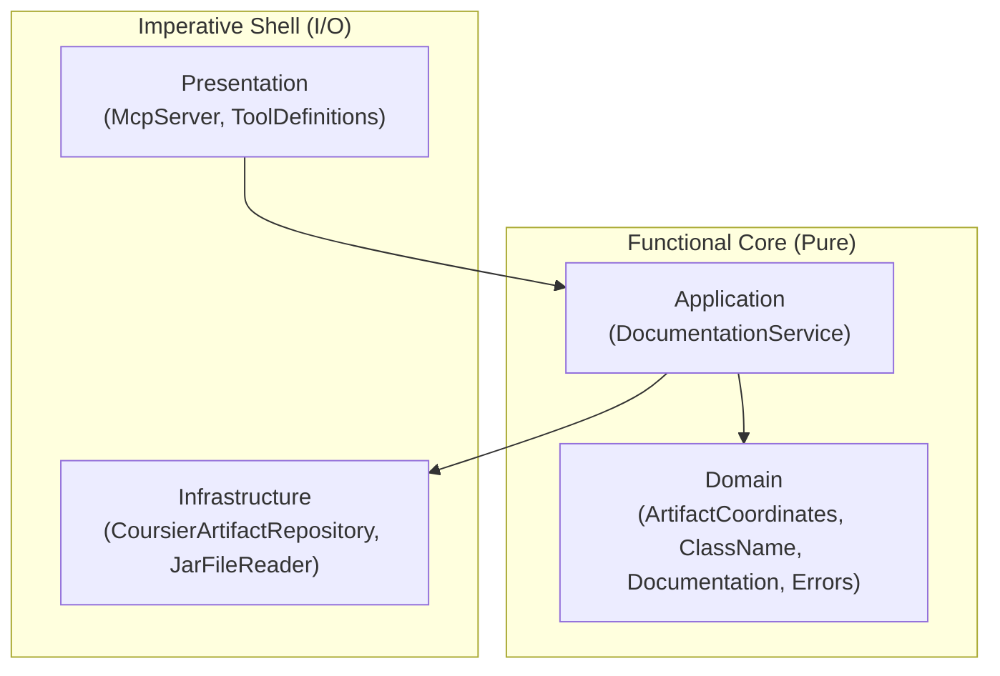

# Review Packet: Phase 1 - Fetch Javadoc HTML for Java class

**Issue:** JMC-1
**Phase:** 1 of 7
**Branch:** JMC-1-phase-01
**Commit:** 154d222

---

## Goals

This phase establishes the **foundational vertical slice** for the javadocs-mcp server:

1. **Working MCP HTTP server** using Chimp that responds to tool invocations
2. **Coursier integration** that resolves and downloads `-javadoc.jar` artifacts from Maven Central
3. **JAR extraction logic** that reads HTML files from downloaded JARs
4. **Class name mapping** that converts `org.slf4j.Logger` to `org/slf4j/Logger.html`
5. **End-to-end flow**: MCP tool request → Coursier → JAR → HTML response

**Success criteria:**
- Claude Code can connect to the running MCP server via HTTP
- Can invoke `get_documentation` tool with Java library coordinates
- Receives valid Javadoc HTML for `org.slf4j.Logger`
- Response time is under 5 seconds for first request
- Error handling works for non-existent classes and artifacts

---

## Scenarios

- [ ] **Happy path**: Invoke `get_documentation` with `org.slf4j:slf4j-api:2.0.9` and `org.slf4j.Logger` → receive valid HTML
- [ ] **Inner class handling**: Request `org.slf4j.Logger$Factory` → correctly maps to `Logger.html`
- [ ] **Missing artifact**: Request non-existent artifact → receive clear "Artifact not found" error
- [ ] **Missing class**: Request non-existent class in valid artifact → receive "Class not found" error
- [ ] **Invalid coordinates**: Request with malformed coordinates → receive validation error
- [ ] **Server startup**: Server starts on port 8080 without errors

---

## Entry Points

| File | Method/Class | Why Start Here |
|------|--------------|----------------|
| `src/main/scala/javadocsmcp/Main.scala` | `run()` | Application entry point - shows dependency wiring |
| `src/main/scala/javadocsmcp/presentation/McpServer.scala` | `McpServer.start()` | HTTP server setup - MCP endpoint registration |
| `src/main/scala/javadocsmcp/presentation/ToolDefinitions.scala` | `getDocumentationTool()` | MCP tool definition - input schema and handler |
| `src/main/scala/javadocsmcp/application/DocumentationService.scala` | `getDocumentation()` | Core business logic - orchestrates the flow |
| `src/main/scala/javadocsmcp/infrastructure/CoursierArtifactRepository.scala` | `fetchJavadocJar()` | External integration - Maven Central access |

---

## Diagrams

### Architecture Overview (Context Diagram)



### Component Diagram



### Request Flow (Sequence Diagram)



### Layer Diagram (FCIS)



---

## Test Summary

| Test | Type | Verifies |
|------|------|----------|
| `ArtifactCoordinatesTest."parse valid Maven coordinates"` | Unit | Parses `groupId:artifactId:version` correctly |
| `ArtifactCoordinatesTest."reject coordinates with missing version"` | Unit | Validates 3-part format required |
| `ArtifactCoordinatesTest."reject coordinates with invalid format"` | Unit | Rejects single-word input |
| `ArtifactCoordinatesTest."reject empty string"` | Unit | Empty input returns error |
| `ClassNameTest."convert class name to HTML path"` | Unit | `org.slf4j.Logger` → `org/slf4j/Logger.html` |
| `ClassNameTest."strip inner class suffix"` | Unit | `Logger$Factory` → `Logger.html` |
| `ClassNameTest."handle nested inner classes"` | Unit | `Outer$Middle$Inner` → `Outer.html` |
| `ClassNameTest."reject empty class name"` | Unit | Empty input returns error |
| `ClassNameTest."reject class name with only whitespace"` | Unit | Whitespace-only returns error |
| `CoursierArtifactRepositoryTest."fetch javadoc JAR for slf4j-api"` | Integration | Downloads real JAR from Maven Central |
| `CoursierArtifactRepositoryTest."return error for non-existent artifact"` | Integration | Handles missing artifact gracefully |
| `CoursierArtifactRepositoryTest."fetch javadoc JAR for guava"` | Integration | Works with different artifacts |
| `JarFileReaderTest."extract HTML from real slf4j javadoc JAR"` | Integration | Reads HTML from downloaded JAR |
| `JarFileReaderTest."return error for non-existent HTML path"` | Integration | Missing class in JAR returns error |
| `JarFileReaderTest."extract HTML from guava javadoc JAR"` | Integration | Works with different JAR structures |
| `DocumentationServiceTest."fetch documentation for org.slf4j.Logger"` | Integration | End-to-end happy path |
| `DocumentationServiceTest."handle inner class by stripping suffix"` | Integration | Inner class → outer class HTML |
| `DocumentationServiceTest."return error for non-existent artifact"` | Integration | Error propagation for missing artifact |
| `DocumentationServiceTest."return error for non-existent class in valid artifact"` | Integration | Error propagation for missing class |
| `DocumentationServiceTest."return error for invalid coordinates format"` | Integration | Validation error propagation |

**Test counts:** 9 unit tests, 11 integration tests, 0 E2E tests

---

## Files Changed

**22 files changed**, +2815 insertions, -14 deletions

### By Layer

| Layer | Files | Purpose |
|-------|-------|---------|
| Domain | 5 | Value objects, entities, error types |
| Application | 1 | Service orchestration |
| Infrastructure | 2 | Coursier + JAR reading |
| Presentation | 3 | MCP server, tool definitions |
| Tests | 5 | Unit + integration tests |
| Config | 2 | project.scala, README |

<details>
<summary>Full file list</summary>

**Production code:**
- `src/main/scala/javadocsmcp/Main.scala` (A) - Entry point
- `src/main/scala/javadocsmcp/application/DocumentationService.scala` (A) - Service
- `src/main/scala/javadocsmcp/domain/ArtifactCoordinates.scala` (A) - Value object
- `src/main/scala/javadocsmcp/domain/ClassName.scala` (A) - Value object
- `src/main/scala/javadocsmcp/domain/Documentation.scala` (A) - Entity
- `src/main/scala/javadocsmcp/domain/Errors.scala` (A) - Error types
- `src/main/scala/javadocsmcp/infrastructure/CoursierArtifactRepository.scala` (A) - Repository
- `src/main/scala/javadocsmcp/infrastructure/JarFileReader.scala` (A) - JAR reader
- `src/main/scala/javadocsmcp/presentation/McpServer.scala` (A) - HTTP server
- `src/main/scala/javadocsmcp/presentation/ToolDefinitions.scala` (A) - MCP tools

**Test code:**
- `src/test/scala/javadocsmcp/domain/ArtifactCoordinatesTest.scala` (A)
- `src/test/scala/javadocsmcp/domain/ClassNameTest.scala` (A)
- `src/test/scala/javadocsmcp/infrastructure/CoursierArtifactRepositoryTest.scala` (A)
- `src/test/scala/javadocsmcp/infrastructure/JarFileReaderTest.scala` (A)
- `src/test/scala/javadocsmcp/application/DocumentationServiceTest.scala` (A)

**Configuration:**
- `project.scala` (M) - Added Chimp, Tapir, MUnit dependencies
- `README.md` (M) - Updated with Phase 1 status

**Project management:**
- `project-management/issues/JMC-1/analysis.md` (A)
- `project-management/issues/JMC-1/phase-01-context.md` (A)
- `project-management/issues/JMC-1/phase-01-tasks.md` (A)
- `project-management/issues/JMC-1/tasks.md` (A)
- `project-management/issues/JMC-1/review-state.json` (A)

</details>

---

## Code Quality Notes

- ✅ All files have `PURPOSE:` comment headers (2-line format)
- ✅ Follows DDD structure: domain/application/infrastructure/presentation
- ✅ Pure functions in domain layer (no side effects)
- ✅ Immutable data structures throughout (case classes)
- ✅ Type-safe error handling with `Either[DocumentationError, _]`
- ✅ Proper resource management (`Using` for JAR files)
- ✅ Real artifact testing (no mocking of Maven Central)

---

## Running the Server

```bash
# Build and run on default port 8080
scala-cli run .

# Run on custom port
scala-cli run . -- 8888

# Run tests
scala-cli test .
```

---

## Next Phase

Phase 2 will add `get_source` tool for fetching Java source code, reusing the established infrastructure.
