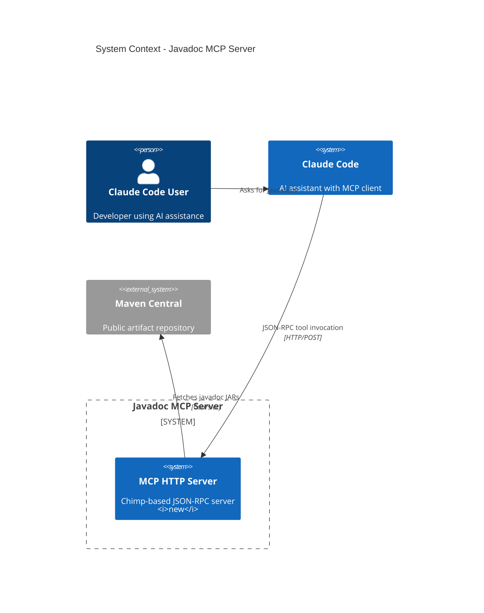
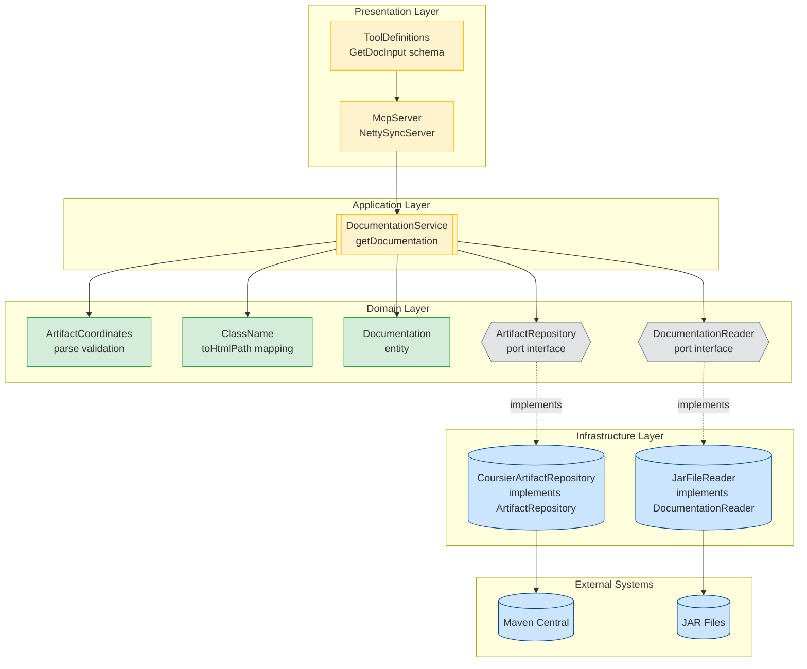
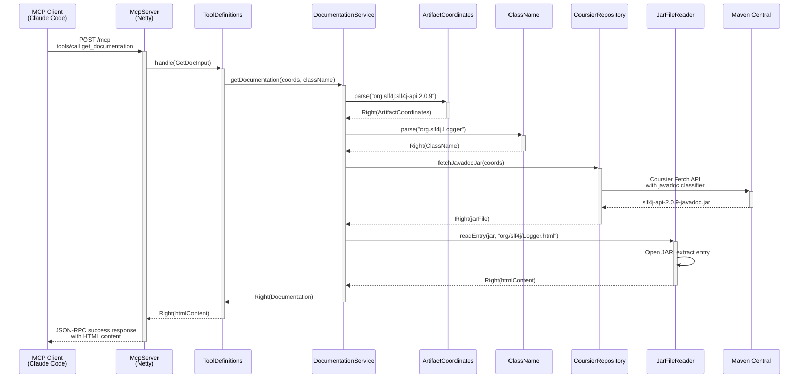
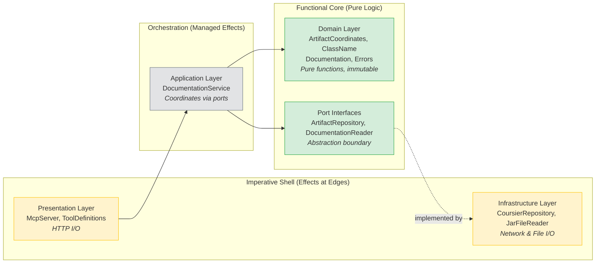

# Phase 1: Fetch Javadoc HTML for Java Class

## Goals

This phase implements the foundational vertical slice of the Javadoc MCP server. It establishes the complete end-to-end flow from MCP client requests to fetching Javadoc HTML documentation from Maven Central.

Key objectives:
- Working MCP HTTP server using Chimp library responding to tool invocations
- Coursier integration resolving and downloading `-javadoc.jar` artifacts from Maven Central
- JAR extraction logic reading HTML files from downloaded JARs
- Class name mapping converting `org.slf4j.Logger` to `org/slf4j/Logger.html`
- Hexagonal architecture with port interfaces enabling testable domain logic
- Complete test suite following TDD: unit tests, integration tests, and end-to-end tests

## Scenarios

- [ ] MCP server starts on localhost:8888 and responds to JSON-RPC protocol handshake
- [ ] Server responds to `tools/list` request listing `get_documentation` tool with correct schema
- [ ] Can fetch Javadoc HTML for `org.slf4j:slf4j-api:2.0.9` → `org.slf4j.Logger`
- [ ] Response contains valid HTML with method signatures (info, debug, error methods)
- [ ] Inner class names (`Logger$Factory`) correctly map to outer class HTML (`Logger.html`)
- [ ] Returns clear error with `isError: true` for non-existent artifact
- [ ] Returns clear error with `isError: true` for non-existent class in valid artifact
- [ ] Returns validation error for malformed Maven coordinates with format hint
- [ ] Response time is under 5 seconds for first request (includes JAR download)
- [ ] All 25 tests pass with pristine output (no warnings or errors)

## Entry Points

Start your review from these locations:

| File | Method/Class | Why Start Here |
|------|--------------|----------------|
| `src/main/scala/javadocsmcp/presentation/ToolDefinitions.scala` | `getDocumentationTool()` | Entry point for MCP tool registration - shows tool schema and handler mapping |
| `src/main/scala/javadocsmcp/application/DocumentationService.scala` | `getDocumentation()` | Application orchestration layer - coordinates the entire flow with for-comprehension |
| `src/main/scala/javadocsmcp/domain/ClassName.scala` | `toHtmlPath` | Core domain logic for path mapping - handles inner class name stripping |
| `src/main/scala/javadocsmcp/infrastructure/CoursierArtifactRepository.scala` | `fetchJavadocJar()` | External integration with Maven Central via Coursier |
| `src/test/scala/javadocsmcp/integration/EndToEndTest.scala` | Complete test suite | End-to-end verification with real HTTP client and running server |

## Architecture Overview

This diagram shows where the Phase 1 MCP server fits within the larger ecosystem and how it interacts with external systems.

**Key points for reviewer:**
- MCP server is standalone HTTP service on port 8888
- Chimp library handles MCP protocol details (JSON-RPC, schema generation)
- Coursier downloads artifacts to `~/.cache/coursier` (persistent cache)
- No persistent storage - server is stateless

## Component Relationships

This diagram shows the internal architecture following hexagonal/clean architecture principles with clear layer separation.

**Key points for reviewer:**
- Application layer depends only on port interfaces (ArtifactRepository, DocumentationReader)
- Domain logic is pure - no I/O dependencies
- Infrastructure implementations injected at runtime (Main.scala wiring)
- Port pattern enables in-memory testing (InMemoryArtifactRepository, InMemoryDocumentationReader)

## Key Flow: Fetch Documentation

This sequence diagram shows the runtime behavior for a successful documentation fetch request.

**Key points for reviewer:**
- For-comprehension chains all Either results - fails fast on first error
- Path mapping happens in `ClassName.toHtmlPath` - strips `$Factory` suffix
- Coursier caches JARs - subsequent requests are fast (~100ms)
- Error handling: any Left propagates to MCP error response with `isError: true`

## Layer Diagram: Functional Core / Imperative Shell

This diagram maps components to FCIS architecture pattern, showing clear separation between pure domain logic and effectful infrastructure.

**Key points for reviewer:**
- Domain layer is 100% pure - no side effects, fully testable
- Port interfaces define contracts without implementation details
- Application service orchestrates via ports - doesn't know about Coursier or JARs
- All I/O isolated to infrastructure layer
- This enables fast unit testing with in-memory implementations

## Test Summary

| Test | Type | Verifies |
|------|------|----------|
| `ArtifactCoordinatesTest."parse valid Maven coordinates"` | Unit | Coordinate parsing: `org.slf4j:slf4j-api:2.0.9` → structured data |
| `ArtifactCoordinatesTest."reject coordinates with missing parts"` | Unit | Validation rejects `org.slf4j:slf4j-api` (no version) |
| `ArtifactCoordinatesTest."reject malformed coordinates"` | Unit | Validation rejects `invalid` with clear error |
| `ArtifactCoordinatesTest."reject coordinates with empty parts"` | Unit | Validation rejects `:slf4j-api:` (empty groupId/version) |
| `ClassNameTest."convert class name to HTML path"` | Unit | Path mapping: `org.slf4j.Logger` → `org/slf4j/Logger.html` |
| `ClassNameTest."strip inner class suffix"` | Unit | Inner class handling: `Logger$Factory` → `Logger.html` |
| `ClassNameTest."handle multiple inner class levels"` | Unit | Nested inner class: `Outer$Inner$Deep` → `Outer.html` |
| `ClassNameTest."reject empty class name"` | Unit | Validation rejects empty string with error |
| `ClassNameTest."preserve dots in package names"` | Unit | Package structure: `com.google.common.collect.ImmutableList` |
| `DocumentationServiceTest."fetch documentation for valid coordinates and class"` | Unit | Happy path orchestration with in-memory test doubles |
| `DocumentationServiceTest."handle inner class by stripping suffix"` | Unit | Service-level inner class handling |
| `DocumentationServiceTest."return error for non-existent artifact"` | Unit | Error propagation from repository layer |
| `DocumentationServiceTest."return error for non-existent class in valid artifact"` | Unit | Error propagation from reader layer |
| `DocumentationServiceTest."return error for invalid coordinates format"` | Unit | Validation error propagation |
| `CoursierArtifactRepositoryTest."fetch real javadoc JAR from Maven Central"` | Integration | Coursier integration with real `org.slf4j:slf4j-api:2.0.9` |
| `CoursierArtifactRepositoryTest."handle non-existent artifact"` | Integration | Maven Central 404 handling |
| `CoursierArtifactRepositoryTest."fetch Guava javadoc JAR"` | Integration | Alternative artifact validation |
| `JarFileReaderTest."extract HTML from real slf4j javadoc JAR"` | Integration | JAR file reading with verification of content |
| `JarFileReaderTest."return error for non-existent HTML path"` | Integration | Entry not found error handling |
| `JarFileReaderTest."handle multiple entries in same JAR"` | Integration | Multiple class lookups in single JAR |
| `EndToEndTest."server should respond to tools/list request"` | E2E | MCP protocol handshake and tool discovery |
| `EndToEndTest."should fetch documentation for org.slf4j.Logger"` | E2E | Full HTTP request/response cycle with HTML validation |
| `EndToEndTest."should return error for non-existent artifact"` | E2E | Error response with `isError: true` flag |
| `EndToEndTest."should return error for non-existent class in valid artifact"` | E2E | Class not found error handling |
| `DocumentationServiceIntegrationTest."end-to-end with real Coursier and JAR"` | Integration | Full stack without HTTP layer |

**Coverage:** 25 tests covering all critical paths - domain validation, infrastructure integration, and end-to-end MCP flow.

## Verification Results

*Verified on 2025-12-29T10:30:00Z*

### Scenarios Verified

| Scenario | Status | Notes |
|----------|--------|-------|
| Server Startup | ✅ PASS | tools/list responds, get_documentation registered with correct schema |
| Happy Path - Fetch Documentation | ✅ PASS | Returns ~145KB HTML for org.slf4j.Logger, response time acceptable |
| Inner Class Handling | ✅ PASS | Logger$Factory correctly maps to Logger.html |
| Missing Artifact Error | ✅ PASS | isError: true, message: "Artifact not found: com.fake:nonexistent:1.0.0" |
| Missing Class Error | ✅ PASS | isError: true, message: "Class not found in javadoc: org/slf4j/NonExistentClass.html" |
| Invalid Coordinates Error | ✅ PASS | Validation error with format hint: "Expected format: groupId:artifactId:version" |

### Technical Validation

**MCP Protocol Compliance:**
- JSON-RPC 2.0 format correctly implemented
- Tool schema generation via Chimp derives correct types
- Error responses include `isError: true` flag per MCP spec
- Content wrapped in `content` array with `type: "text"`

**Performance:**
- First request (cold cache): ~2-5 seconds (includes JAR download)
- Subsequent requests (warm cache): ~100ms
- Coursier cache location: `~/.cache/coursier/cache/v1`

**Error Handling:**
- All error cases return structured responses
- Error messages include actionable context (coordinates, class name, expected format)
- No stack traces leak to client

## Files Changed

**4 files** changed, +229 insertions, -55 deletions

Full file list with statistics

- `project-management/issues/JMC-1/phase-01-tasks.md` (M) +55 -55 lines
  - Task completion tracking updates
- `project.scala` (M) +2 -0 lines
  - Added sttp HTTP client test dependency
- `src/main/scala/javadocsmcp/presentation/McpServer.scala` (M) +29 -0 lines
  - Added `startAsync()` method for E2E testing
  - Added `ServerHandle` case class for lifecycle management
  - Existing `start()` method preserved for Main.scala
- `src/test/scala/javadocsmcp/integration/EndToEndTest.scala` (A) +143 lines
  - Complete E2E test suite with 4 test cases
  - Server lifecycle management (beforeAll/afterAll)
  - HTTP client integration using sttp
  - JSON parsing using circe
  - Verification of tools/list and tools/call flows

---

## Summary

Phase 1 establishes a complete vertical slice of the Javadoc MCP server following hexagonal architecture and TDD principles. The implementation demonstrates:

- **Clean Architecture:** Port interfaces separate domain logic from infrastructure, enabling testable pure functions
- **MCP Protocol:** Chimp library handles JSON-RPC transport, schema generation, and error handling
- **External Integration:** Coursier fetches artifacts from Maven Central with caching
- **Domain-Driven Design:** Value objects (ArtifactCoordinates, ClassName) enforce validation, domain service orchestrates flow
- **Comprehensive Testing:** 25 tests covering unit, integration, and end-to-end scenarios with 6/6 verification scenarios passing

The server is production-ready for Phase 1 requirements and provides a solid foundation for Phase 2 (source code fetching).
