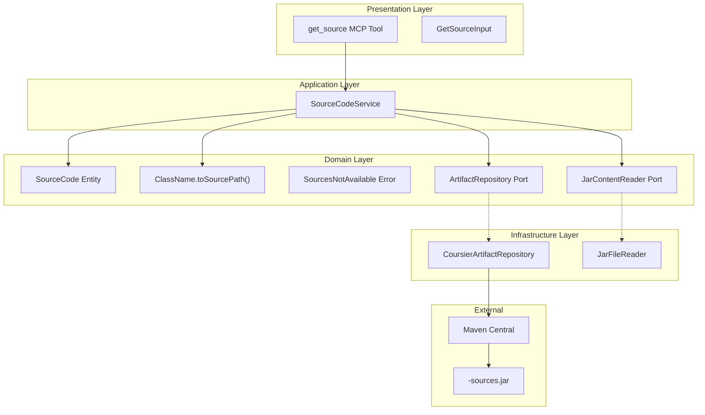
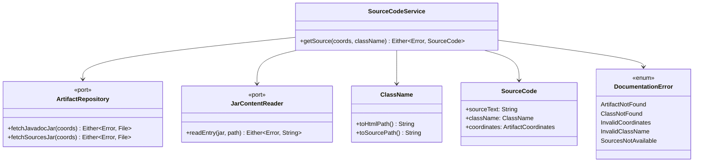
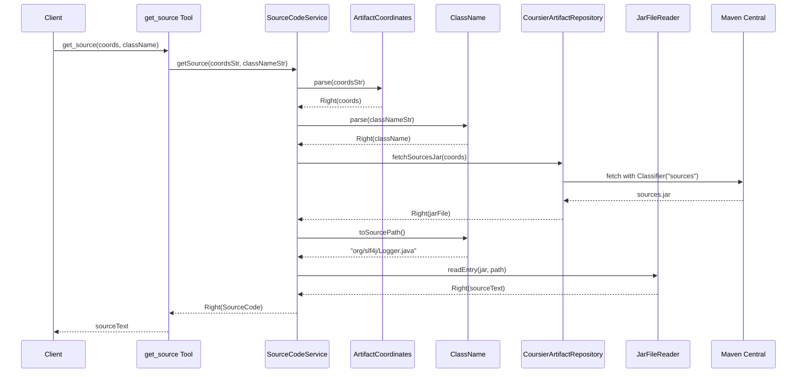
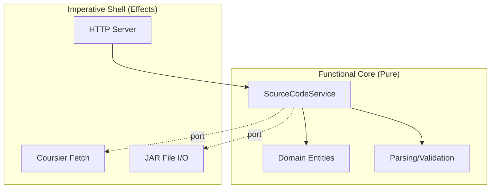

# Review Packet: Phase 2 - Fetch Source Code for Java Class

**Issue:** JMC-1
**Phase:** 2 of 7
**Story:** Fetch source code for a Java library class

---

## Goals

This phase extends the MCP server to fetch Java source code from Maven Central artifacts:

1. **New `get_source` MCP tool** - Fetches Java source code from `-sources.jar` artifacts
2. **Source code extraction** - Reads `.java` files from source JARs using Coursier
3. **Class name mapping** - Converts `org.slf4j.Logger` to `org/slf4j/Logger.java`
4. **Reusable infrastructure** - Leverages existing patterns from Phase 1
5. **Complete test coverage** - Unit, integration, and E2E tests

---

## Scenarios

- [ ] User can invoke `get_source` tool with Maven coordinates and class name
- [ ] System returns valid Java source code for `org.slf4j:slf4j-api:2.0.9` → `org.slf4j.Logger`
- [ ] Source contains expected interface definition and method signatures
- [ ] Response time is under 5 seconds for first request
- [ ] System returns helpful error when sources JAR not available
- [ ] System returns helpful error when class not found in sources JAR
- [ ] Inner class references correctly map to outer class source file

---

## Entry Points

| File | Method/Class | Why Start Here |
|------|--------------|----------------|
| `presentation/ToolDefinitions.scala` | `getSourceTool()` | MCP tool definition - API contract |
| `application/SourceCodeService.scala` | `getSource()` | Business logic orchestration |
| `domain/ClassName.scala` | `toSourcePath()` | Core path mapping logic (new method) |
| `infrastructure/CoursierArtifactRepository.scala` | `fetchSourcesJar()` | Coursier integration for sources |
| `domain/Errors.scala` | `SourcesNotAvailable` | New error type for source failures |

---

## Diagrams

### Architecture Overview

### Component Relationships

### Request Flow Sequence

### Layer Diagram (FCIS)

---

## Test Summary

| Test | Type | Verifies |
|------|------|----------|
| `ClassNameTest."convert class name to source path"` | Unit | Correct `.java` path generation |
| `ClassNameTest."strip inner class suffix for source path"` | Unit | Inner class handling (`$` suffix) |
| `ClassNameTest."handle nested inner classes for source path"` | Unit | Multi-level nested classes |
| `SourceCodeServiceTest."fetch source code for valid coordinates and class"` | Unit | Happy path with in-memory mocks |
| `SourceCodeServiceTest."handle inner class by stripping suffix"` | Unit | Service handles inner classes |
| `SourceCodeServiceTest."return error for sources JAR not available"` | Unit | SourcesNotAvailable error path |
| `SourceCodeServiceTest."return error for non-existent class"` | Unit | ClassNotFound error path |
| `SourceCodeServiceTest."return error for invalid coordinates"` | Unit | InvalidCoordinates error path |
| `SourceCodeServiceIntegrationTest."fetch real source code for org.slf4j.Logger"` | Integration | Real Maven Central fetch |
| `SourceCodeServiceIntegrationTest."fetch real source code for guava ImmutableList"` | Integration | Additional real artifact |
| `SourceCodeServiceIntegrationTest."handle inner class correctly"` | Integration | Real inner class resolution |
| `EndToEndTest."server should respond to tools/list request"` | E2E | Both tools registered |
| `EndToEndTest."should fetch source code for org.slf4j.Logger"` | E2E | Complete HTTP flow |
| `EndToEndTest."should return error for artifact without sources JAR"` | E2E | Error via HTTP |
| `EndToEndTest."should return error for non-existent class in sources JAR"` | E2E | Error via HTTP |

**Test Counts:**
- Unit tests: 8 new tests (5 SourceCodeService + 3 ClassName toSourcePath)
- Integration tests: 3 new tests
- E2E tests: 3 new tests (plus 4 existing Phase 1 tests)

---

## Files Changed

**24 files changed**, +6062 insertions, -14 deletions

Full file list

### New Files (A)
- `src/main/scala/javadocsmcp/application/SourceCodeService.scala`
- `src/main/scala/javadocsmcp/domain/SourceCode.scala`
- `src/main/scala/javadocsmcp/domain/ports/JarContentReader.scala`
- `src/test/scala/javadocsmcp/application/SourceCodeServiceTest.scala`
- `src/test/scala/javadocsmcp/application/SourceCodeServiceIntegrationTest.scala`
- `src/test/scala/javadocsmcp/testkit/InMemoryJarContentReader.scala`

### Modified Files (M)
- `src/main/scala/javadocsmcp/Main.scala` - Wire SourceCodeService
- `src/main/scala/javadocsmcp/application/DocumentationService.scala` - Use JarContentReader
- `src/main/scala/javadocsmcp/domain/ClassName.scala` - Add toSourcePath()
- `src/main/scala/javadocsmcp/domain/Errors.scala` - Add SourcesNotAvailable
- `src/main/scala/javadocsmcp/domain/ports/ArtifactRepository.scala` - Add fetchSourcesJar()
- `src/main/scala/javadocsmcp/infrastructure/CoursierArtifactRepository.scala` - Implement fetchSourcesJar()
- `src/main/scala/javadocsmcp/infrastructure/JarFileReader.scala` - Implement JarContentReader
- `src/main/scala/javadocsmcp/presentation/McpServer.scala` - Register both tools
- `src/main/scala/javadocsmcp/presentation/ToolDefinitions.scala` - Add getSourceTool
- `src/test/scala/javadocsmcp/domain/ClassNameTest.scala` - Add source path tests
- `src/test/scala/javadocsmcp/infrastructure/CoursierArtifactRepositoryTest.scala` - Add sources tests
- `src/test/scala/javadocsmcp/infrastructure/JarFileReaderTest.scala` - Add .java tests
- `src/test/scala/javadocsmcp/integration/EndToEndTest.scala` - Add get_source tests
- `src/test/scala/javadocsmcp/testkit/InMemoryArtifactRepository.scala` - Add fetchSourcesJar

### Renamed Files
- `DocumentationReader.scala` → `JarContentReader.scala` (generic naming)
- `InMemoryDocumentationReader.scala` → `InMemoryJarContentReader.scala`

---

## Key Implementation Decisions

1. **Renamed `DocumentationReader` → `JarContentReader`** - More generic name since it works with any JAR content (HTML or Java source)

2. **Extended existing port** - Added `fetchSourcesJar()` to `ArtifactRepository` rather than creating new port, since both methods handle artifact fetching

3. **Parallel service structure** - `SourceCodeService` mirrors `DocumentationService` for consistency and future refactoring potential

4. **New error type** - `SourcesNotAvailable` provides helpful message suggesting `get_documentation` as alternative

5. **Code reuse** - `JarFileReader` works unchanged for both HTML and Java files; only the path extension differs

---

## Review Checklist

- [ ] Port traits properly abstracted (`ArtifactRepository`, `JarContentReader`)
- [ ] `SourceCodeService` mirrors `DocumentationService` structure
- [ ] All functions pure except at edges (Coursier, File I/O)
- [ ] Immutable data structures throughout
- [ ] No compiler warnings
- [ ] `PURPOSE:` comments on all new files
- [ ] Domain language used in naming
- [ ] All tests pass (unit, integration, E2E)
