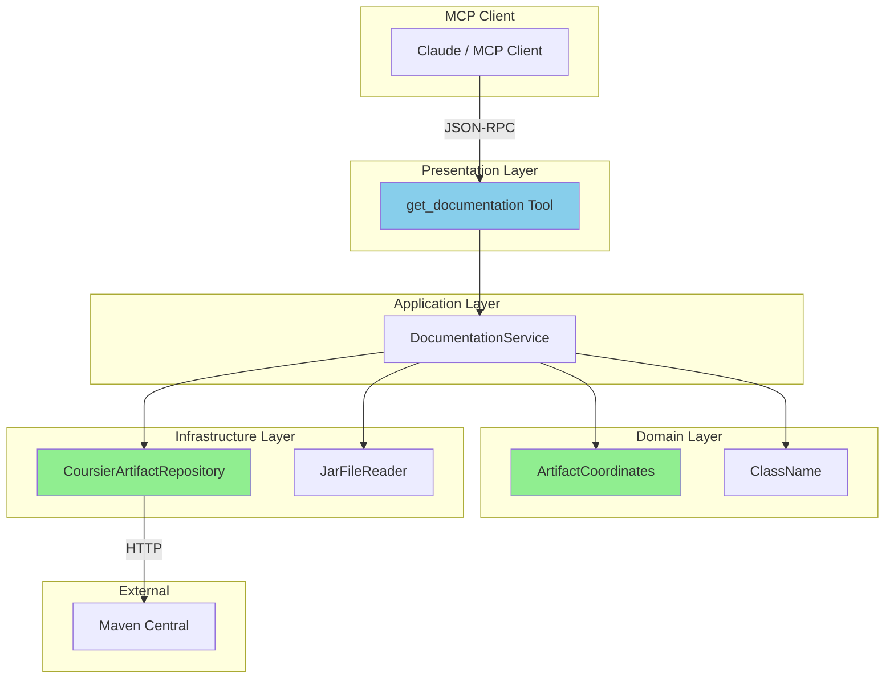
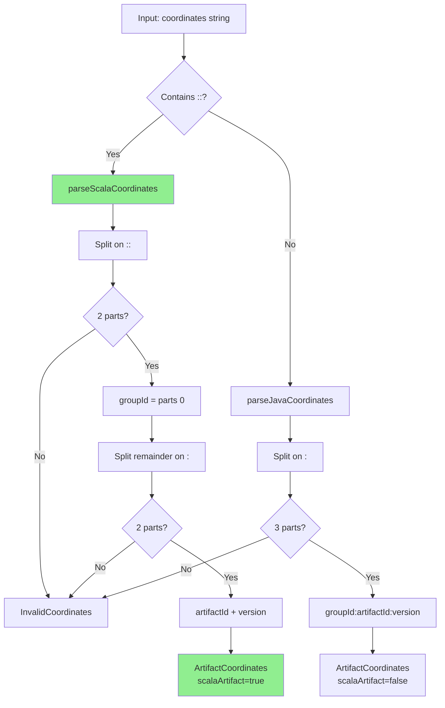
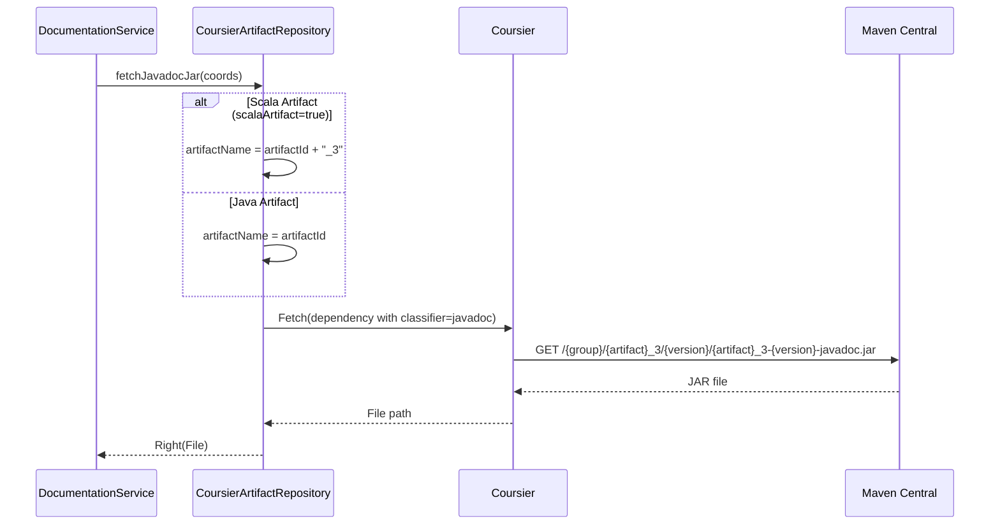
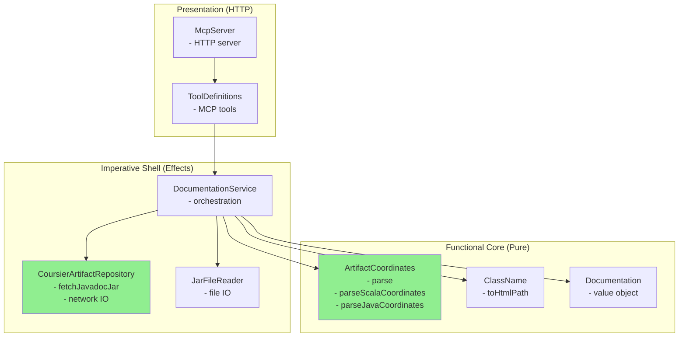

# Review Packet: Phase 3 - Fetch Scaladoc HTML for Scala class

**Issue:** JMC-1
**Phase:** 3 of 7
**Branch:** JMC-1-phase-03

## Goals

This phase extends the existing `get_documentation` tool to support Scala libraries with Scaladoc. The key accomplishments are:

1. **Scala coordinate parsing** - Support `::` separator (e.g., `org.typelevel::cats-effect:3.5.4`)
2. **Coursier Scala resolution** - Automatically append `_3` suffix for Scala 3 artifacts
3. **Scaladoc HTML extraction** - Works transparently since Scaladoc uses same `-javadoc` classifier
4. **Backward compatibility** - All existing Java functionality unchanged
5. **Updated tool descriptions** - Document both Java (`:`) and Scala (`::`) coordinate formats

## Scenarios

- [x] Parse Scala coordinates with `::` separator correctly
- [x] Parse Java coordinates with `:` separator (regression test)
- [x] Fetch Scaladoc JAR for cats-effect via Coursier
- [x] Fetch Scaladoc JAR for ZIO via Coursier
- [x] Extract HTML documentation for `cats.effect.IO` class
- [x] Return error for non-existent Scala artifact
- [x] Return error for non-existent class in valid Scala artifact
- [x] All existing Java tests still pass (no regression)
- [x] Response time under 5 seconds for first request

## Entry Points

| File | Method/Class | Why Start Here |
|------|--------------|----------------|
| `domain/ArtifactCoordinates.scala` | `ArtifactCoordinates.parse()` | Entry point for coordinate parsing - detects `::` vs `:` |
| `domain/ArtifactCoordinates.scala` | `parseScalaCoordinates()` | New private method handling Scala coordinate format |
| `infrastructure/CoursierArtifactRepository.scala` | `fetchJavadocJar()` | Applies `_3` suffix for Scala artifacts |
| `presentation/ToolDefinitions.scala` | `getDocumentationTool()` | Updated description with Scala examples |
| `integration/EndToEndTest.scala` | `"should fetch Scaladoc for cats.effect.IO"` | E2E test proving full flow works |

## Diagrams

### Architecture Overview

### Coordinate Parsing Flow

### Coursier Resolution Flow

### Layer Diagram (FCIS)

## Test Summary

| Test | Type | Verifies |
|------|------|----------|
| `ArtifactCoordinatesTest."parse valid Scala coordinates with :: separator"` | Unit | Scala coordinate parsing works |
| `ArtifactCoordinatesTest."parse zio Scala coordinates"` | Unit | Another Scala library parses correctly |
| `ArtifactCoordinatesTest."reject Scala coordinates with missing version"` | Unit | Validation rejects incomplete coordinates |
| `ArtifactCoordinatesTest."reject Scala coordinates with wrong separator count"` | Unit | Validation rejects malformed `:::` |
| `ArtifactCoordinatesTest."Java coordinates still work (regression test)"` | Unit | No regression in Java parsing |
| `CoursierArtifactRepositoryTest."fetch Scaladoc JAR for cats-effect"` | Integration | Real cats-effect Scaladoc downloads |
| `CoursierArtifactRepositoryTest."fetch Scaladoc JAR for ZIO"` | Integration | Real ZIO Scaladoc downloads |
| `CoursierArtifactRepositoryTest."return error for non-existent Scala artifact"` | Integration | Error handling for missing Scala artifacts |
| `DocumentationServiceIntegrationTest."fetch Scaladoc for cats.effect.IO"` | Integration | Full service flow for Scala docs |
| `EndToEndTest."should fetch Scaladoc for cats.effect.IO"` | E2E | HTTP request returns Scaladoc HTML |
| `EndToEndTest."should return error for non-existent Scala artifact"` | E2E | Error via HTTP for missing artifact |
| `EndToEndTest."should return error for non-existent class in Scala artifact"` | E2E | Error via HTTP for missing class |

## Files Changed

**8 files changed**, +359 insertions, -108 deletions

Full file list

- `src/main/scala/javadocsmcp/domain/ArtifactCoordinates.scala` (M) - Added `scalaArtifact` field and `::` parsing
- `src/main/scala/javadocsmcp/infrastructure/CoursierArtifactRepository.scala` (M) - Added `_3` suffix for Scala artifacts
- `src/main/scala/javadocsmcp/presentation/ToolDefinitions.scala` (M) - Updated tool descriptions with Scala examples
- `src/test/scala/javadocsmcp/domain/ArtifactCoordinatesTest.scala` (M) - Added 5 new Scala coordinate tests
- `src/test/scala/javadocsmcp/infrastructure/CoursierArtifactRepositoryTest.scala` (M) - Added 4 new Scala artifact tests
- `src/test/scala/javadocsmcp/application/DocumentationServiceIntegrationTest.scala` (M) - Added 2 Scala integration tests
- `src/test/scala/javadocsmcp/integration/EndToEndTest.scala` (M) - Added 3 new Scala E2E tests
- `project-management/issues/JMC-1/phase-03-tasks.md` (M) - Task checkboxes updated

## Key Implementation Details

### Scala Coordinate Handling

The `::` separator in Scala coordinates (e.g., `org.typelevel::cats-effect:3.5.4`) indicates a cross-built Scala artifact. Coursier needs the actual artifact name with the Scala version suffix (e.g., `cats-effect_3`).

**Implementation approach:**
1. `ArtifactCoordinates.parse()` detects `::` and routes to `parseScalaCoordinates()`
2. The `scalaArtifact: Boolean` field tracks whether this is a Scala artifact
3. `CoursierArtifactRepository.fetchJavadocJar()` appends `_3` suffix when `scalaArtifact=true`

### Why `_3` Suffix?

- This project runs on Scala 3, so we resolve Scala 3 artifacts
- Scaladoc JARs follow the same naming: `cats-effect_3-3.5.4-javadoc.jar`
- The `-javadoc` classifier is identical to Javadoc (Scaladoc reuses it)

### Transparent Service Layer

`DocumentationService` required **no changes** - the coordinate parsing and infrastructure handle everything transparently. This validates the clean architecture separation.
