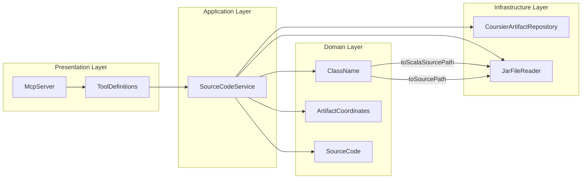
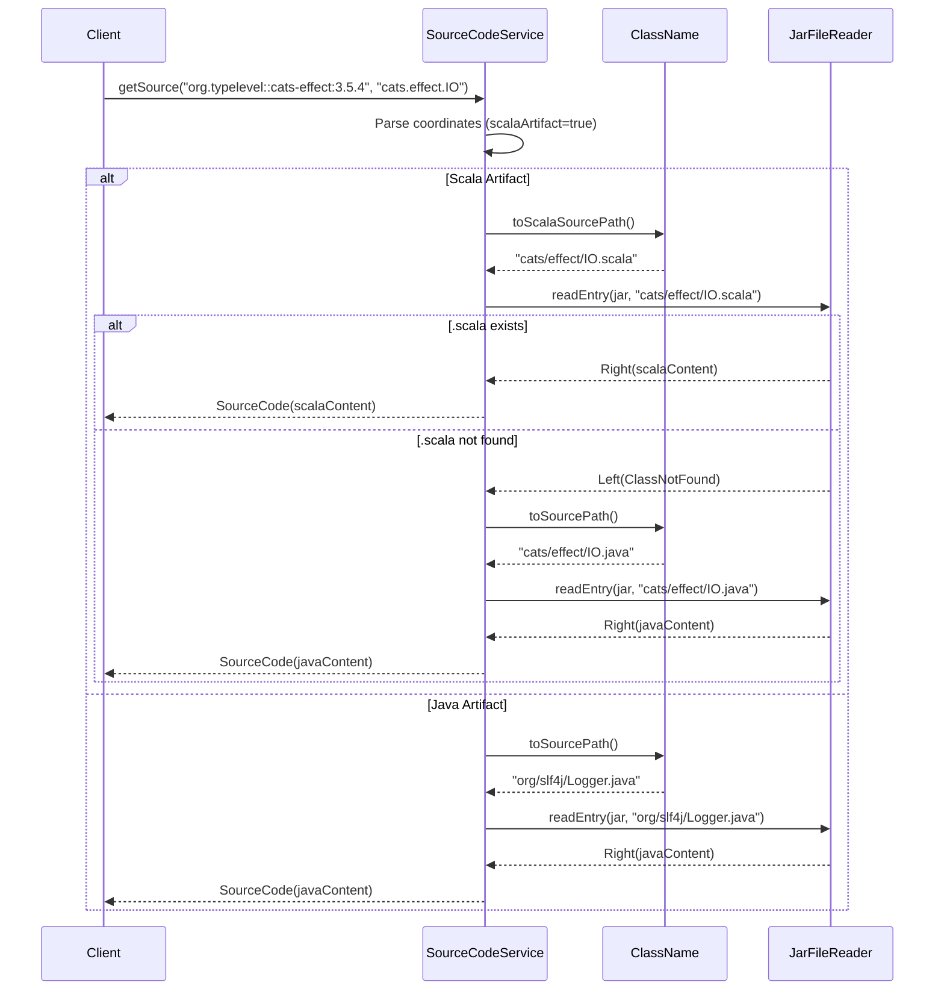
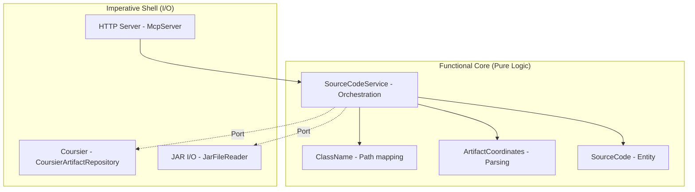

# Review Packet: Phase 4 - Fetch source code for Scala class

**Issue:** JMC-1
**Phase:** 4 of 7
**Story:** Fetch source code for Scala library class

---

## Goals

This phase enables the `get_source` MCP tool to fetch Scala source code from Maven Central:

- **Primary goal**: Return actual `.scala` source files for Scala library classes
- **Scala-first lookup**: Try `.scala` extension first for Scala artifacts (`::` coordinates)
- **Graceful fallback**: Fall back to `.java` extension for mixed Java/Scala projects
- **No regression**: Java artifacts continue to work exactly as before

After this phase, AI assistants can retrieve Scala source code:
```json
{
  "coordinates": "org.typelevel::cats-effect:3.5.4",
  "className": "cats.effect.IO"
}
```
Returns `IO.scala` with Scala syntax like `sealed abstract class IO[+A]`.

---

## Scenarios

- [x] Fetch Scala source for `cats.effect.IO` returns valid `.scala` content
- [x] Source contains Scala-specific syntax (`sealed abstract class`, `def flatMap`)
- [x] Java artifacts still return `.java` source correctly (no regression)
- [x] Response time under 5 seconds for first request
- [x] Scala artifact with only `.java` files falls back correctly
- [x] Non-existent Scala class returns appropriate error

---

## Entry Points

| File | Method/Class | Why Start Here |
|------|--------------|----------------|
| `SourceCodeService.scala:23-29` | `getSource()` fallback logic | **Core change**: Extension fallback for Scala artifacts |
| `ClassName.scala:22` | `toScalaSourcePath` | **New method**: Returns `.scala` file path |
| `ClassName.scala:9-16` | `toPath(extension)` | **Refactored**: DRY helper for path generation |
| `SourceCodeServiceTest.scala:133-180` | Scala fallback tests | **New tests**: Verify fallback behavior |
| `EndToEndTest.scala:357-439` | E2E Scala source tests | **E2E**: Complete MCP protocol flow |

---

## Diagrams

### Component Relationships



### Extension Fallback Flow



### Layer Diagram (FCIS)



---

## Test Summary

| Test | Type | Verifies |
|------|------|----------|
| `ClassName.toScalaSourcePath` | Unit | `.scala` extension generation |
| `ClassName.toScalaSourcePath strips inner class` | Unit | Inner class handling for Scala |
| `SourceCodeService.Scala artifact tries .scala first` | Unit | Primary extension lookup |
| `SourceCodeService.Fall back to .java` | Unit | Fallback when .scala missing |
| `SourceCodeService.Java artifact only tries .java` | Unit | No regression for Java |
| `SourceCodeServiceIntegration.cats.effect.IO` | Integration | Real Maven Central fetch |
| `SourceCodeServiceIntegration.zio.ZIO` | Integration | Second library validation |
| `EndToEnd.Scala source for cats.effect.IO` | E2E | Full MCP protocol flow |
| `EndToEnd.Scala source for zio.ZIO` | E2E | Multiple library validation |
| `EndToEnd.Error for non-existent Scala class` | E2E | Error handling via MCP |

**Test counts:**
- Unit tests: 11 total (3 new for Scala source)
- Integration tests: 5 total (2 new for Scala source)
- E2E tests: 18 total (3 new for Scala source)

---

## Files Changed

**7 files changed, +209 insertions, -29 deletions**

<details>
<summary>Full file list</summary>

| File | Change | Description |
|------|--------|-------------|
| `src/main/scala/javadocsmcp/domain/ClassName.scala` | M | Added `toScalaSourcePath`, refactored to DRY helper |
| `src/main/scala/javadocsmcp/application/SourceCodeService.scala` | M | Added `.scala` → `.java` fallback for Scala artifacts |
| `src/test/scala/javadocsmcp/domain/ClassNameTest.scala` | M | +2 tests for Scala source path |
| `src/test/scala/javadocsmcp/application/SourceCodeServiceTest.scala` | M | +3 tests for fallback logic |
| `src/test/scala/javadocsmcp/application/SourceCodeServiceIntegrationTest.scala` | M | +2 tests with real Scala artifacts |
| `src/test/scala/javadocsmcp/integration/EndToEndTest.scala` | M | +3 E2E tests for Scala source |
| `project-management/issues/JMC-1/phase-04-tasks.md` | M | Checked off completed tasks |

</details>

---

## Key Implementation Details

### 1. ClassName DRY Refactoring

Before: Duplicate path logic in each method
```scala
def toHtmlPath: String = {
  val outerClass = fullyQualifiedName.split('$').head
  outerClass.replace('.', '/') + ".html"
}
def toSourcePath: String = {
  val outerClass = fullyQualifiedName.split('$').head
  outerClass.replace('.', '/') + ".java"
}
```

After: Single private helper
```scala
private def toPath(extension: String): String = {
  val outerClass = fullyQualifiedName.split('$').head
  val path = outerClass.replace('.', '/')
  s"$path$extension"
}

def toHtmlPath: String = toPath(".html")
def toSourcePath: String = toPath(".java")
def toScalaSourcePath: String = toPath(".scala")
```

### 2. Extension Fallback Logic

Simple, elegant use of `orElse`:
```scala
if coords.scalaArtifact then
  // Try .scala first, fall back to .java for mixed-source projects
  reader.readEntry(sourcesJar, className.toScalaSourcePath)
    .orElse(reader.readEntry(sourcesJar, className.toSourcePath))
else
  // Java artifacts only have .java files
  reader.readEntry(sourcesJar, className.toSourcePath)
```

---

## Review Checklist

- [ ] `toScalaSourcePath` correctly returns `.scala` extension
- [ ] Inner class stripping works for Scala paths
- [ ] Fallback only triggers when `.scala` not found
- [ ] Java artifacts don't attempt `.scala` lookup
- [ ] Error messages are clear for missing classes
- [ ] Integration tests use real Maven Central artifacts
- [ ] E2E tests verify full MCP protocol flow
