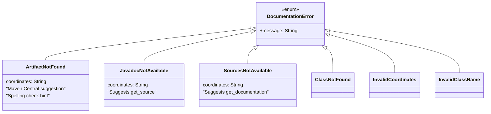
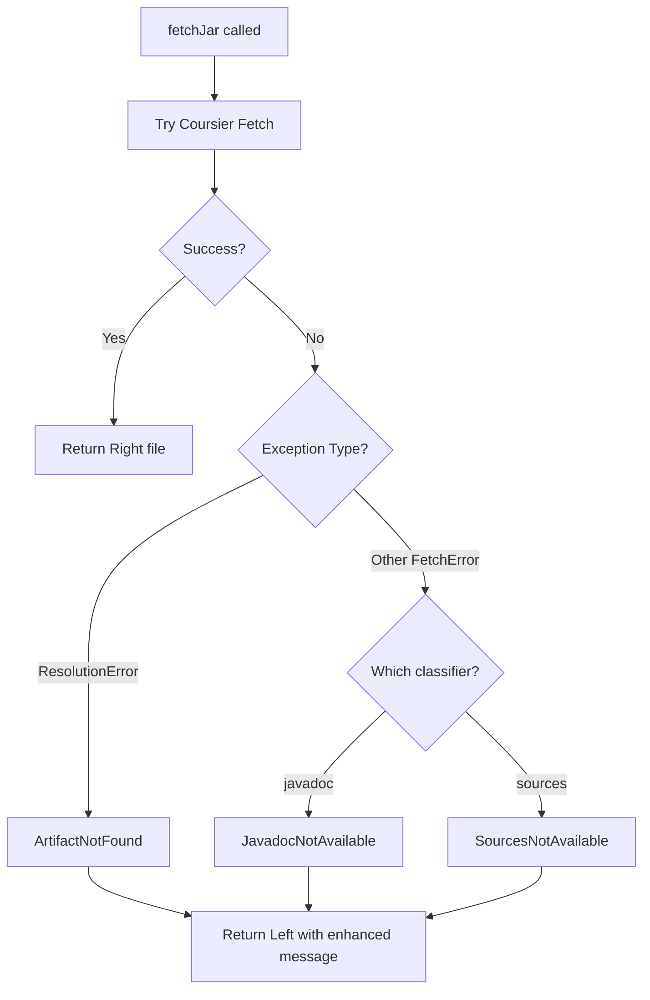
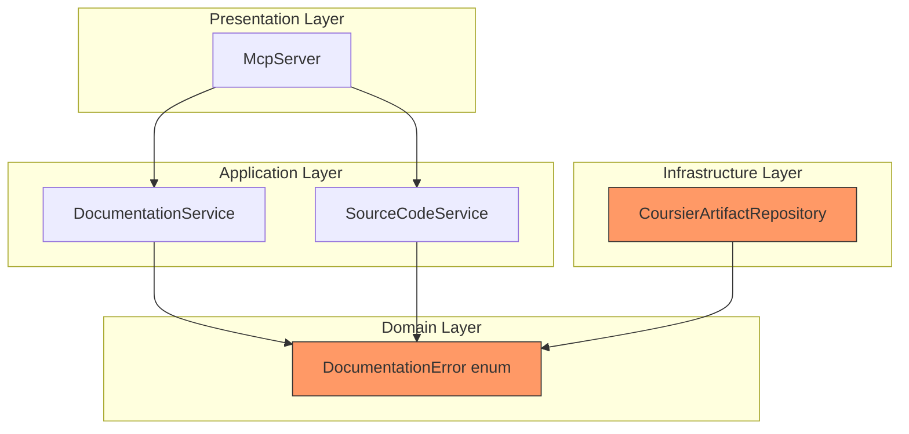

# Review Packet: Phase 5 - Handle Missing Artifacts Gracefully

## Goals

This phase enhances error handling to provide clear, actionable error messages when:

1. **Artifact does not exist** in any Maven repository
2. **Javadoc JAR is not published** (artifact exists but javadoc classifier missing)
3. **Sources JAR is not published** (artifact exists but sources classifier missing)

The goal is **production readiness** - transforming technical Coursier exceptions into user-friendly messages that help AI assistants inform users about typos or unavailable libraries.

## Scenarios

- [x] Non-existent artifact returns multi-line error with Maven Central URL and spelling suggestions
- [x] Missing javadoc classifier returns `JavadocNotAvailable` with `get_source` suggestion
- [x] Missing sources classifier returns `SourcesNotAvailable` with `get_documentation` suggestion
- [x] Class not found error includes capitalization hints
- [x] Invalid coordinates error shows both Java (`:`) and Scala (`::`) format examples
- [x] Server remains stable after error responses (no crashes, subsequent requests work)

## Entry Points

| File | Method/Class | Why Start Here |
|------|--------------|----------------|
| `domain/Errors.scala` | `DocumentationError` enum | Core error types and message formatting - all error messages defined here |
| `infrastructure/CoursierArtifactRepository.scala` | `fetchJar()` | Error detection logic - distinguishes ResolutionError from FetchError |
| `domain/ErrorsTest.scala` | Test class | Unit tests verifying all error message formats |
| `integration/EndToEndTest.scala` | E2E tests | Verifies error messages through MCP protocol |

## Diagrams

### Error Type Hierarchy



### Error Detection Flow



### Layer Diagram



## Test Summary

| Test | Type | Verifies |
|------|------|----------|
| `ArtifactNotFound message includes coordinates` | Unit | Coordinates in error message |
| `ArtifactNotFound message includes Maven Central suggestion` | Unit | Maven Central URL present |
| `ArtifactNotFound message includes spelling check suggestion` | Unit | Spelling hint included |
| `JavadocNotAvailable message includes coordinates` | Unit | Coordinates in javadoc error |
| `JavadocNotAvailable message suggests using get_source` | Unit | Alternative tool suggested |
| `JavadocNotAvailable message explains libraries don't publish javadoc` | Unit | Explanation present |
| `SourcesNotAvailable message includes coordinates` | Unit | Coordinates in sources error |
| `SourcesNotAvailable message suggests using get_documentation` | Unit | Alternative tool suggested |
| `SourcesNotAvailable message explains libraries don't publish sources` | Unit | Explanation present |
| `ClassNotFound message includes class name` | Unit | Class name in error |
| `ClassNotFound message suggests checking spelling and capitalization` | Unit | Case-sensitivity hint |
| `InvalidCoordinates message includes invalid input` | Unit | Input echoed back |
| `InvalidCoordinates message shows expected format examples` | Unit | Format examples shown |
| `InvalidCoordinates message distinguishes Java and Scala formats` | Unit | Both `:` and `::` formats |
| `InvalidClassName message includes invalid input` | Unit | Input echoed back |
| `InvalidClassName message shows expected format` | Unit | Example format shown |
| `non-existent artifact returns ArtifactNotFound error` | Integration | Coursier error mapping |
| `non-existent artifact for sources returns ArtifactNotFound error` | Integration | Sources error mapping |
| `missing javadoc classifier returns JavadocNotAvailable error` | Integration | Message format correct |
| `error messages include artifact coordinates` | Integration | Coordinates propagated |
| `error messages for sources include coordinates` | Integration | Sources coordinates |
| `artifact not found error includes Maven Central suggestion` | E2E | Full MCP error response |
| `artifact not found error is multi-line and helpful` | E2E | Multi-line formatting |
| `server remains stable after error responses` | E2E | No crash after errors |

**Summary:** 16 unit tests + 5 integration tests + 3 E2E tests = **24 new tests**

## Files Changed

**4 files changed** (Phase 5 implementation only)

| File | Change | Lines |
|------|--------|-------|
| `src/main/scala/javadocsmcp/domain/Errors.scala` | Modified | +35 |
| `src/main/scala/javadocsmcp/infrastructure/CoursierArtifactRepository.scala` | Modified | +15 |
| `src/test/scala/javadocsmcp/domain/ErrorsTest.scala` | **New** | +127 |
| `src/test/scala/javadocsmcp/infrastructure/CoursierArtifactRepositoryTest.scala` | Modified | +62 |
| `src/test/scala/javadocsmcp/integration/EndToEndTest.scala` | Modified | +88 |

<details>
<summary>Full file list</summary>

- `src/main/scala/javadocsmcp/domain/Errors.scala` (M) - Enhanced error messages
- `src/main/scala/javadocsmcp/infrastructure/CoursierArtifactRepository.scala` (M) - Error detection
- `src/test/scala/javadocsmcp/domain/ErrorsTest.scala` (A) - Unit tests for errors
- `src/test/scala/javadocsmcp/infrastructure/CoursierArtifactRepositoryTest.scala` (M) - Integration tests
- `src/test/scala/javadocsmcp/integration/EndToEndTest.scala` (M) - E2E tests

</details>

## Key Implementation Details

### Enhanced Error Messages

**Before (terse):**
```
Artifact not found: com.nonexistent:fake-library:1.0.0
```

**After (multi-line, helpful):**
```
Artifact not found: com.nonexistent:fake-library:1.0.0

Please check:
- Spelling of groupId, artifactId, and version
- Artifact exists on Maven Central: https://search.maven.org/
- Version number is correct
```

### New `JavadocNotAvailable` Error Type

Distinguishes between "artifact doesn't exist" and "javadoc classifier not published":

```scala
case JavadocNotAvailable(coordinates) =>
  s"""Javadoc JAR not available for: $coordinates
     |
     |Some libraries don't publish javadoc to Maven Central.
     |Try using get_source instead to view the source code.""".stripMargin
```

### Coursier Exception Detection

```scala
ex match
  case _: coursier.error.ResolutionError =>
    // Artifact doesn't exist at all
    Left(DocumentationError.ArtifactNotFound(coordsStr))
  case _ =>
    // Classifier not found - use specific error constructor
    Left(errorConstructor(coordsStr))
```

## Review Focus Areas

1. **Error message clarity** - Are messages helpful for AI assistants?
2. **Exception mapping** - Does Coursier error detection correctly distinguish cases?
3. **Test coverage** - Are all error paths tested?
4. **Alternative suggestions** - Do error messages guide users to working alternatives?
