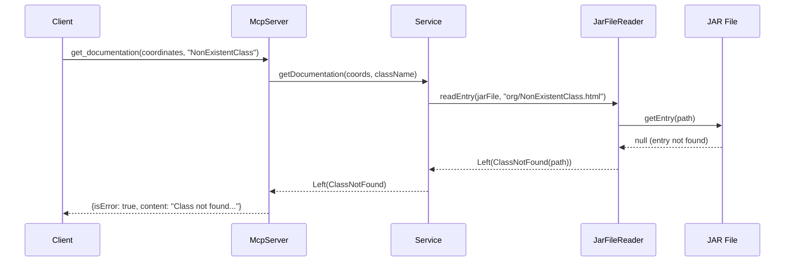
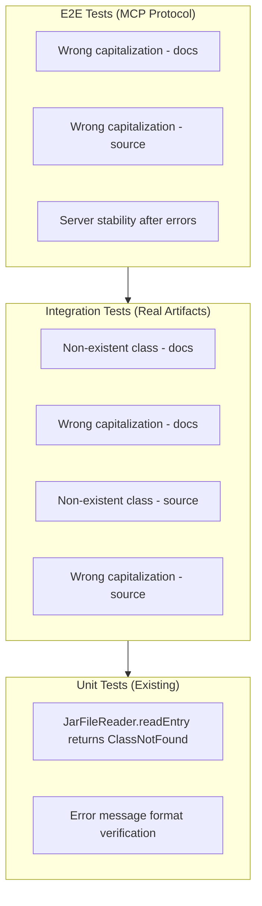

# Review Packet: Phase 6 - Handle Missing Classes Within Artifacts

**Issue:** JMC-1
**Phase:** 6 of 7
**Story:** Error handling for missing classes

---

## Goals

This phase completes the error handling foundation by providing comprehensive test coverage for `ClassNotFound` errors. The goal is to verify that when a class doesn't exist within a valid artifact JAR, users receive clear, actionable error messages that help them understand:

1. **Class name typos or incorrect spelling** - Error includes the class name
2. **Incorrect capitalization** - Error mentions case-sensitivity (JVM is case-sensitive)
3. **Wrong artifact** - Error suggests checking if class is in a transitive dependency

After this phase, the MCP server has **comprehensive error coverage** for all failure scenarios:
- ✅ Artifact not found (Phase 5)
- ✅ Javadoc/Sources JAR not available (Phase 5)
- ✅ **Class not found in JAR (Phase 6)** ← THIS PHASE

**Key Insight:** This phase is primarily a **testing phase**. The implementation already exists from previous phases - Phase 6 validates the behavior works correctly.

---

## Scenarios

- [ ] **Non-existent class returns ClassNotFound error** - Request `org.slf4j.NonExistentClass` from valid artifact returns error with class name in message
- [ ] **Wrong capitalization detected** - Request `org.slf4j.logger` (lowercase) returns ClassNotFound with case-sensitivity hint
- [ ] **Error message is actionable** - Messages include spelling hint, capitalization warning, and artifact verification suggestion
- [ ] **Both tools handle missing classes** - Both `get_documentation` and `get_source` return helpful errors
- [ ] **Server remains stable after errors** - Subsequent valid requests succeed after ClassNotFound errors

---

## Entry Points

| File | Method/Class | Why Start Here |
|------|--------------|----------------|
| `EndToEndTest.scala:493` | `test("should return error for wrong capitalization in get_documentation")` | E2E test for MCP protocol error responses - validates complete flow |
| `DocumentationServiceIntegrationTest.scala:48` | `test("return ClassNotFound for non-existent class in valid artifact")` | Integration test with real Maven Central artifacts |
| `SourceCodeServiceIntegrationTest.scala:74` | `test("return ClassNotFound for non-existent class in valid sources JAR")` | Validates sources tool handles missing classes same as documentation |
| `EndToEndTest.scala:541` | `test("server remains stable after error responses")` | Validates error handling doesn't corrupt server state |

---

## Diagrams

### Error Flow Sequence



### Test Coverage Layers



---

## Test Summary

| Test | Type | Verifies |
|------|------|----------|
| `DocumentationServiceIntegrationTest."return ClassNotFound for non-existent class"` | Integration | Non-existent class returns ClassNotFound with class name in message |
| `DocumentationServiceIntegrationTest."return ClassNotFound for wrong capitalization"` | Integration | Wrong case (org.slf4j.logger) returns ClassNotFound with case-sensitivity hint |
| `SourceCodeServiceIntegrationTest."return ClassNotFound for non-existent class"` | Integration | Sources JAR handles missing classes same as documentation |
| `SourceCodeServiceIntegrationTest."return ClassNotFound for wrong capitalization"` | Integration | Sources detect and report capitalization errors |
| `EndToEndTest."should return error for wrong capitalization in get_documentation"` | E2E | MCP protocol returns proper error response for capitalization errors |
| `EndToEndTest."should return error for wrong capitalization in get_source"` | E2E | Source tool MCP error responses work correctly |
| `EndToEndTest."server remains stable after error responses"` | E2E | Server handles errors gracefully without corrupting state |

**Total New Tests:** 6 tests added in Phase 6
**All Tests:** 91 tests passing

---

## Files Changed

**3** files changed (tests only - no production code changes)

<details>
<summary>Full file list</summary>

- `src/test/scala/javadocsmcp/application/DocumentationServiceIntegrationTest.scala` (M) - Added 2 tests for ClassNotFound scenarios
- `src/test/scala/javadocsmcp/application/SourceCodeServiceIntegrationTest.scala` (M) - Added 2 tests for ClassNotFound scenarios
- `src/test/scala/javadocsmcp/integration/EndToEndTest.scala` (M) - Added 3 E2E tests for capitalization and stability
- `project-management/issues/JMC-1/phase-06-tasks.md` (M) - Task checkboxes updated

</details>

---

## Key Implementation Notes

### No Production Code Changes Needed

Phase 6 validates existing behavior - the `ClassNotFound` error handling was already implemented:

1. **JarFileReader.readEntry()** already returns `Left(ClassNotFound(path))` when JAR entry is missing
2. **Error message** was already enhanced in Phase 5 with multi-line format and helpful suggestions
3. **Error propagation** through service layer already works correctly

### Test Strategy

- **Integration tests** use real Maven Central artifacts (org.slf4j:slf4j-api:2.0.9) to verify actual behavior
- **E2E tests** verify MCP protocol error responses are formatted correctly
- **Stability test** ensures server can handle errors without corrupting state

### Error Message Format (from Phase 5)

```
Class not found in JAR: org/slf4j/logger.html

Please check:
- Class name spelling and capitalization (case-sensitive)
- Class is part of this artifact (not a transitive dependency)
```

---

## Review Checklist

- [ ] Tests cover both documentation and source tools
- [ ] Tests verify error message contains class name
- [ ] Tests verify error message mentions case-sensitivity
- [ ] Integration tests use real Maven Central artifacts
- [ ] E2E tests verify MCP protocol error response format
- [ ] Server stability test confirms error recovery
- [ ] All 91 tests pass
