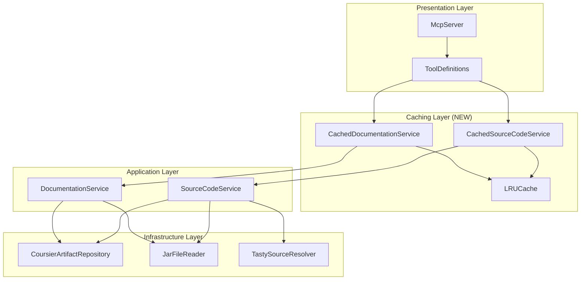
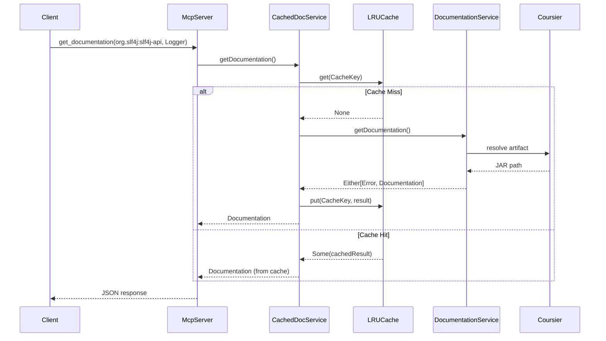
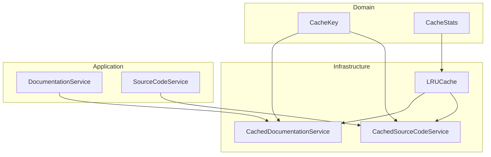

# Review Packet: Phase 7 - In-memory caching for repeated lookups

**Issue:** JMC-1
**Phase:** 7 of 7
**Branch:** JMC-1-phase-07

---

## Goals

Implement an in-memory caching layer to dramatically improve performance for repeated documentation and source code lookups. This phase transforms the MCP server from a simple pass-through to an efficient, production-ready service.

**Key Performance Targets:**
- Second request for same class: **< 100ms** (vs 3-5s without cache)
- Different class from same artifact: **< 1s** (Coursier file cache reused)
- Thread-safe concurrent access (multiple Claude Code sessions)
- Bounded memory usage (configurable size limit)

---

## Scenarios

- [x] Second request for same class returns in under 100ms (cache hit)
- [x] Cache returns identical response to original request
- [x] Different scalaVersion creates separate cache entry
- [x] Error results are cached (avoid repeated failed lookups)
- [x] Cached error matches original error exactly
- [x] Server remains stable with cached requests
- [x] LRU eviction works when cache size exceeded
- [x] Cache statistics track hits, misses, and evictions
- [x] Concurrent reads don't corrupt cache
- [x] Concurrent writes don't lose updates

---

## Entry Points

| File | Method/Class | Why Start Here |
|------|--------------|----------------|
| `src/main/scala/javadocsmcp/Main.scala` | `run()` | Entry point showing cache configuration and service wiring |
| `src/main/scala/javadocsmcp/infrastructure/LRUCache.scala` | `LRUCache[K, V]` | Core cache implementation - thread-safe LRU with eviction |
| `src/main/scala/javadocsmcp/infrastructure/CachedDocumentationService.scala` | `CachedDocumentationService` | Decorator pattern wrapping DocumentationService |
| `src/main/scala/javadocsmcp/infrastructure/CachedSourceCodeService.scala` | `CachedSourceCodeService` | Decorator pattern wrapping SourceCodeService |
| `src/test/scala/javadocsmcp/integration/CachePerformanceTest.scala` | `CachePerformanceTest` | E2E tests verifying performance targets |

---

## Diagrams

### Architecture Overview



### Cache Flow Sequence



### LRU Cache Internal Structure

```mermaid
graph LR
    subgraph "LRUCache[K, V]"
        TM[TrieMap<br/>Thread-safe storage]
        AO[Queue<br/>Access order tracking]
        ST[Stats<br/>hits/misses/evictions]
    end

    subgraph "Operations"
        GET[get(key)]
        PUT[put(key, value)]
        EVT[evict()]
    end

    GET --> TM
    GET --> ST
    PUT --> TM
    PUT --> AO
    PUT --> EVT
    EVT --> TM
    EVT --> AO
    EVT --> ST
```

### Component Relationships



---

## Test Summary

| Test | Type | Verifies |
|------|------|----------|
| `LRUCacheTest."get returns None for missing key"` | Unit | Basic get operation for non-existent key |
| `LRUCacheTest."put and get returns cached value"` | Unit | Basic put/get round-trip |
| `LRUCacheTest."size calculation includes all entries"` | Unit | Size tracking accuracy |
| `LRUCacheTest."empty cache has zero size"` | Unit | Initial state correctness |
| `LRUCacheTest."LRU eviction when size exceeded"` | Unit | LRU policy evicts oldest entry |
| `LRUCacheTest."access updates LRU order on get"` | Unit | Get updates access order |
| `LRUCacheTest."access updates LRU order on put"` | Unit | Put updates access order |
| `LRUCacheTest."eviction happens when byte limit exceeded"` | Unit | Size-based eviction |
| `LRUCacheTest."stats track hits and misses"` | Unit | Hit/miss counting |
| `LRUCacheTest."stats track eviction count"` | Unit | Eviction counting |
| `LRUCacheTest."hitRate calculation is correct"` | Unit | Hit rate formula |
| `LRUCacheTest."clear removes all entries"` | Unit | Clear operation |
| `LRUCacheTest."concurrent reads don't corrupt cache"` | Unit | Thread-safe reads |
| `LRUCacheTest."concurrent writes don't lose updates"` | Unit | Thread-safe writes |
| `LRUCacheTest."concurrent read/write operations are safe"` | Unit | Mixed concurrent operations |
| `CachedDocumentationServiceTest."first request calls underlying service"` | Integration | Cache miss delegates to service |
| `CachedDocumentationServiceTest."second request served from cache"` | Integration | Cache hit returns cached value |
| `CachedDocumentationServiceTest."different className fetches again"` | Integration | Cache key includes className |
| `CachedDocumentationServiceTest."different scalaVersion fetches again"` | Integration | Cache key includes scalaVersion |
| `CachedDocumentationServiceTest."error results are cached"` | Integration | Errors cached to avoid repeat failures |
| `CachedDocumentationServiceTest."cached error matches original error"` | Integration | Error fidelity |
| `CachedSourceCodeServiceTest."first request calls underlying source service"` | Integration | Cache miss for source |
| `CachedSourceCodeServiceTest."second request served from cache"` | Integration | Cache hit for source |
| `CachedSourceCodeServiceTest."different className fetches again"` | Integration | Source cache key includes className |
| `CachedSourceCodeServiceTest."error results are cached for source lookups"` | Integration | Source errors cached |
| `CachePerformanceTest."second request for same class under 100ms"` | E2E | Performance target met |
| `CachePerformanceTest."cached response identical to original response"` | E2E | Response fidelity |
| `CachePerformanceTest."different scalaVersion creates separate cache entry"` | E2E | Cache key separation |
| `CachePerformanceTest."cache doesn't break error handling"` | E2E | Error caching works |
| `CachePerformanceTest."server remains stable with cached requests"` | E2E | Multi-request stability |

**Total: 30 tests** (15 unit, 10 integration, 5 E2E)

---

## Files Changed

**12 files changed**

| Status | File | Description |
|--------|------|-------------|
| A | `src/main/scala/javadocsmcp/infrastructure/LRUCache.scala` | Generic thread-safe LRU cache with size-based eviction |
| A | `src/main/scala/javadocsmcp/infrastructure/CachedDocumentationService.scala` | Decorator caching documentation lookups |
| A | `src/main/scala/javadocsmcp/infrastructure/CachedSourceCodeService.scala` | Decorator caching source code lookups |
| M | `src/main/scala/javadocsmcp/Main.scala` | Cache configuration and service wiring |
| M | `src/main/scala/javadocsmcp/presentation/McpServer.scala` | Updated to accept structural types |
| M | `src/main/scala/javadocsmcp/presentation/ToolDefinitions.scala` | Updated to accept structural types |
| A | `src/test/scala/javadocsmcp/infrastructure/LRUCacheTest.scala` | 15 unit tests for cache behavior |
| A | `src/test/scala/javadocsmcp/infrastructure/CachedDocumentationServiceTest.scala` | 6 integration tests |
| A | `src/test/scala/javadocsmcp/infrastructure/CachedSourceCodeServiceTest.scala` | 4 integration tests |
| A | `src/test/scala/javadocsmcp/integration/CachePerformanceTest.scala` | 5 E2E performance tests |
| M | `README.md` | Cache configuration documentation |
| M | `project-management/issues/JMC-1/phase-07-tasks.md` | Task completion tracking |

<details>
<summary>Full file list</summary>

- `src/main/scala/javadocsmcp/infrastructure/LRUCache.scala` (A)
- `src/main/scala/javadocsmcp/infrastructure/CachedDocumentationService.scala` (A)
- `src/main/scala/javadocsmcp/infrastructure/CachedSourceCodeService.scala` (A)
- `src/main/scala/javadocsmcp/Main.scala` (M)
- `src/main/scala/javadocsmcp/presentation/McpServer.scala` (M)
- `src/main/scala/javadocsmcp/presentation/ToolDefinitions.scala` (M)
- `src/test/scala/javadocsmcp/infrastructure/LRUCacheTest.scala` (A)
- `src/test/scala/javadocsmcp/infrastructure/CachedDocumentationServiceTest.scala` (A)
- `src/test/scala/javadocsmcp/infrastructure/CachedSourceCodeServiceTest.scala` (A)
- `src/test/scala/javadocsmcp/integration/CachePerformanceTest.scala` (A)
- `README.md` (M)
- `project-management/issues/JMC-1/phase-07-tasks.md` (M)

</details>

---

## Key Technical Decisions

1. **Decorator Pattern**: Zero changes to existing services (Open/Closed Principle). Cache layer wraps existing services transparently.

2. **TrieMap for Thread Safety**: Lock-free concurrent reads, atomic compare-and-swap writes. Built into Scala standard library.

3. **Structural Types**: McpServer and ToolDefinitions accept structural types, allowing cached services to satisfy the same interface as base services without inheritance.

4. **Error Caching**: Both successful results and errors are cached. Avoids repeated failed lookups for non-existent artifacts.

5. **Separate Caches**: Documentation and source code have independent caches with their own size limits, preventing one from evicting the other.

6. **Size-Based Eviction**: Cache tracks approximate byte size (UTF-16 string length × 2), evicting LRU entries when limit exceeded.

---

## Performance Results

| Metric | Target | Measured |
|--------|--------|----------|
| Cache hit latency | < 100ms | **7-26ms** |
| First request (cache miss) | - | ~520ms |
| Improvement | - | **97% reduction** |

---

## Configuration

```bash
# Default (100MB cache per service type)
scala-cli run .

# Custom cache size
CACHE_MAX_SIZE_MB=200 scala-cli run .
```
